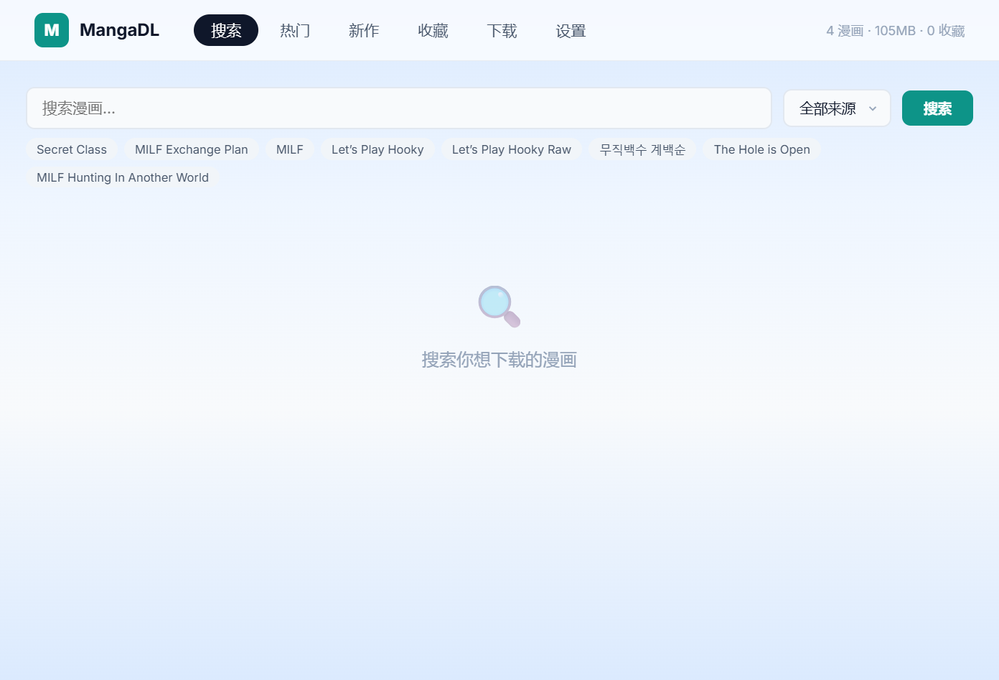

<div align="center">

# 📚 MangaDL

多源漫画搜索、在线阅读、浏览器打包下载与本地批量下载工具



[](https://github.com/jiujiu532/MangaDL/actions)

</div>

## 项目简介

MangaDL 是一个以 **Web 使用体验** 为主的漫画工具：

- 多源并发搜索
- 在线阅读与章节切换
- 浏览器 ZIP 下载 / 服务器后台下载
- 收藏、分组、追更与下载历史
- Docker 部署与本地 JSON 数据持久化

当前仓库的 Web 端由 Flask 提供服务，入口文件 `server.py` 已经是**薄入口**，实际实现位于 `web/` 目录。仓库里也保留了复用同一套核心模块的 `app.py`（PyQt5 GUI），但本 README 重点面向 **终端使用者 / Docker 部署者**。

> `requirements.txt` 仅覆盖当前 Web 运行所需依赖；若你要使用 `app.py` 桌面 GUI，需要额外准备 PyQt5 环境。

## ✨ 主要功能

- 🔍 **多源搜索**：同时搜索多个漫画源，结果统一展示
- 🔥 **热门 / 最新列表**：按来源查看热门与最新更新
- 📖 **在线阅读**：内置阅读器，支持章节切换与快捷键
- 📡 **跨源对比**：详情页可比较其他来源的匹配结果、延迟与章节数
- ⬇️ **两种下载方式**：
  - 服务器后台下载到本地目录
  - 浏览器直接流式打包 ZIP 下载
- ⭐ **收藏与追更**：支持分组、批量检测更新、Raw/翻译偏好
- 📋 **下载历史**：记录手动下载与追更下载
- ⚙️ **可配置项**：下载目录、章节并发、图片并发、代理、主题
- 🐳 **Docker 支持**：适合 NAS / 家用服务器 / 轻量自托管场景

## 🌐 当前内置来源

- MangaForFree
- ManhwaClub
- MangaRead
- ManhwaHub
- MangaDNA
- XToon
- Manga18

> 漫画源站点结构可能随时变动，若某个来源失效，通常需要更新对应 `sources/` 适配器。

## 🚀 快速开始

### 方式一：本地直接运行

建议 Python 3.9+。

```bash
pip install -r requirements.txt
python server.py
```

启动后访问：`http://localhost:5000`

默认数据位置：

- 下载目录：`~/MangaDownloads`
- 配置文件：`~/.manga_downloader/config.json`
- 收藏 / 下载记录：`~/.manga_downloader/favorites.json`

### 方式二：Docker 运行

仓库包含 `Dockerfile`，并通过 GitHub Actions 自动构建 GHCR 镜像。

由于 `server.py` 的本地启动入口默认监听 `127.0.0.1`，并会尝试打开浏览器，所以容器里请显式改用下面的 `flask` 启动命令。

```bash
docker run -d \
  --name mangadl \
  -p 5000:5000 \
  -v ./manga:/data/manga \
  -v ./config:/root/.manga_downloader \
  ghcr.io/jiujiu532/mangadl:latest \
  python -m flask --app server:app run --host 0.0.0.0 --port 5000
```

启动后访问：`http://localhost:5000`

### Docker Compose

```yaml
services:
  mangadl:
    image: ghcr.io/jiujiu532/mangadl:latest
    container_name: mangadl
    command: python -m flask --app server:app run --host 0.0.0.0 --port 5000
    ports:
      - "5000:5000"
    volumes:
      - ./manga:/data/manga
      - ./config:/root/.manga_downloader
    restart: unless-stopped
```

```bash
docker compose up -d
```

### Docker 使用提示

如果你希望下载内容写入挂载出来的 `./manga` 目录，请在首次启动后到 **设置** 页面把下载目录改成：

```text
/data/manga
```

否则应用会继续使用默认的 `/root/MangaDownloads`（对应配置默认值 `~/MangaDownloads`）。

## 🔧 配置与数据说明

项目**不使用数据库**，所有本地状态都写入 JSON 文件，迁移和备份比较直接。

### 主要配置项

| 配置项 | 默认值 | 说明 |
|--------|--------|------|
| `download_dir` | `~/MangaDownloads` | 漫画下载目录 |
| `chapter_concurrency` | `50` | 同时处理的章节任务数 |
| `image_concurrency` | `300` | 全局图片下载并发 |
| `proxy_mode` | `none` | `none` / `http` / `socks5` |
| `proxy_host` | `127.0.0.1` | 代理地址 |
| `proxy_port` | `7890` | 代理端口 |
| `theme` | `dark` | Web / GUI 共用主题偏好 |

### 数据文件

- `~/.manga_downloader/config.json`：基础配置、代理、主题、搜索历史
- `~/.manga_downloader/favorites.json`：收藏、分组、追更记录、下载历史

## 📖 阅读器快捷键

| 快捷键 | 功能 |
|--------|------|
| `←` `→` | 上一章 / 下一章 |
| `Space` | 向下翻页 |
| `Home` | 跳到顶部 |
| `End` | 跳到底部 |
| `Esc` | 关闭阅读器 |

## 📁 项目结构

当前仓库已经不是“单个 `server.py` 大一统实现”，而是 **薄入口 + `web/` 模块化 Flask 实现 + 共享核心模块** 的结构：

```text
.
├── server.py                # Flask 薄入口；导出并启动 app
├── web/
│   ├── __init__.py          # 导出 app / create_app
│   ├── app.py               # Flask app 创建与路由装配
│   ├── state.py             # Web 共享状态与单例容器
│   ├── routes_pages.py      # 页面路由
│   ├── routes_sources.py    # 搜索 / 热门 / 最新 / 详情 / 源状态
│   ├── routes_images.py     # 图片代理 / 预取
│   ├── routes_download.py   # 下载任务 / ZIP 下载 / 日志 / 历史
│   ├── routes_favorites.py  # 收藏 / 追更 / 追更 ZIP
│   ├── routes_config.py     # 配置 / 健康检查 / 统计
│   ├── listing_cache.py     # 热门 / 最新列表缓存
│   ├── image_cache.py       # 图片缓存与代理
│   ├── zip_stream.py        # 浏览器流式 ZIP 下载
│   └── utils.py             # Web 侧辅助函数
├── sources/                 # 漫画源 adapter
├── download_manager.py      # 下载核心
├── config.py                # 本地配置 JSON 持久化
├── favorites.py             # 收藏 / 历史 JSON 持久化
├── scripts/                 # 辅助构建脚本
├── packaging/               # PyInstaller 打包配置
├── static/                  # Web 前端脚本与样式
├── templates/               # Flask 模板
├── app.py                   # PyQt5 GUI 入口（复用同一核心模块）
├── workers.py               # GUI worker
├── Dockerfile
├── pyproject.toml           # Ruff lint/format 配置
├── requirements.txt
└── requirements-dev.txt
```

## 🛠️ 开发说明（简版）

如果你要继续维护这个仓库，建议先知道这几点：

1. **Web 入口很薄**：`server.py` 只负责导出 / 启动，真实 Flask 实现在 `web/`
2. **抓取逻辑集中在 `sources/`**：新增来源不要直接写进 `server.py`
3. **下载核心集中在 `download_manager.py`**
4. **本地状态是 JSON，不是数据库**
5. **项目已接入 Ruff**，开发时可使用：

```bash
pip install -r requirements-dev.txt
ruff check .
ruff format .
```

如果你在当前仓库内继续按 Trellis 流程协作，相关任务与规范文件位于 `.trellis/`。

## 📜 License

MIT License
